# Пользовательская документация `hardload.exe`

### Назначение
Программа hardload.exe создана для локального копирования любых файлов из одной папки в другую.

### Условия использования ПО
Данное ПО предусмотрено для некоммерческого использования, то есть только один пользователь использует ее для личных потребностей.

### Подготовка к работе
1. На электронную почту, либо на мессенджер Telegram придет письмо с приложением `hardload.exe`;

2. Необходимо нажать на файл `hardload.exe`, после чего начнется загрузка программы;

3. Скачанный файл отображается в нижней панели загрузки, либо находится в папке “загрузки”. Любым удобным способом запускаем файл, после запуска открывается окно:

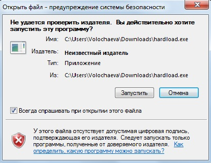

4. Нажимаем запустить;

5. Программа запущена и готова к работе.

### Работа с системой
Программа проста в использовании, легко и быстро усваивается пользователями, визуальная составляющая:

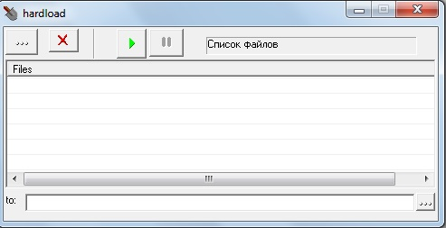

Программа состоит из шести различных кнопок, а именно:

1. **Найти и добавить файл в список** — позволяет открыть общий доступ ко всем файлам. С помощью данной кнопки, добавляем необходимые файлы к дальнейшему копированию, кнопка выделена красным цветом.

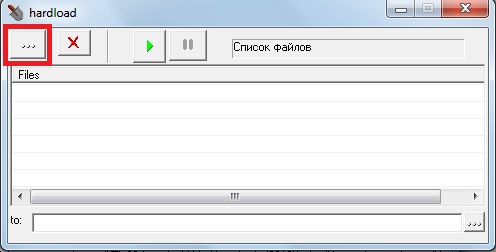

Нажимаем на кнопку  **Найти и добавить файл в список**. Далее открывается окно:

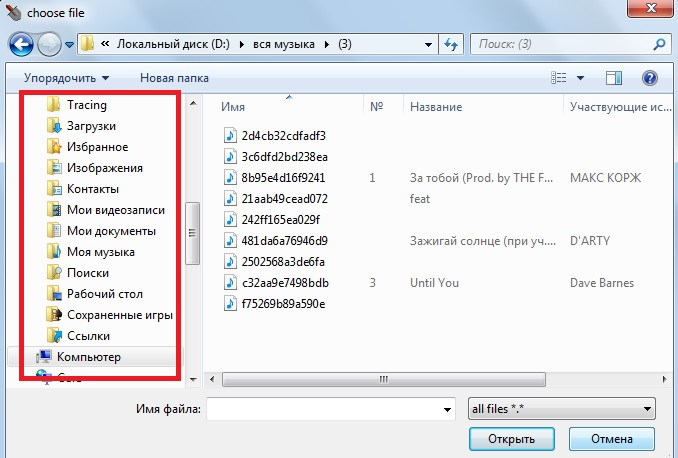

Из общего списка папок, расположенного слева (выделено красным цветом), необходимо открыть папку, в которой хранятся файлы для копирования. Выбираем необходимый документ и нажимаем открыть.

Файлы добавлены в общий список файлов, подготовленных к дальнейшему копированию:

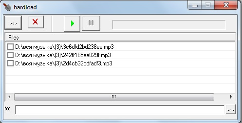

**ОГРАНИЧЕНИЯ**: Невозможно добавить полный список файлов к копированию, путем выделения всех файлов (Ctrl+A) и нажатию кнопки “открыть”. Для копирования двух и более файлов, необходимо добавлять каждый файл поочередно, в соответствии, с проделанными действиями выше.

2. **Выбрать папку куда писать файлы** — позволяет открыть общий доступ ко всем файлам. С помощью данной кнопки, выбираем папку, в которую необходимо перенести копии файлов, кнопка выделена красным цветом.
   Нажимаем на кнопку “Выбрать папку куда писать файлы”, далее открывается аналогичное окно, как указано на [изображении выше](#file-select). Выбираем из общего списка, расположенного слева (выделено красным цветом), папку, в которую необходимо скопировать документы.

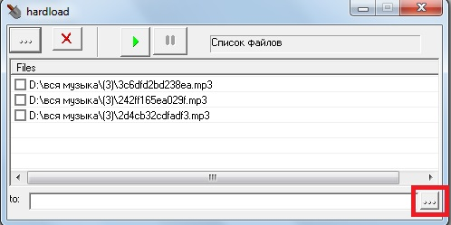

**ОГРАНИЧЕНИЯ**: Невозможно одновременно скопировать файлы в разные папки. Для копирования файлов в разные папки, необходимо выполнять действия выше, путем смены выбора папки для копирования.

3. **Чекбокс** — позволяет выбрать один или несколько файлов для дальнейшего копирования, либо удаления.

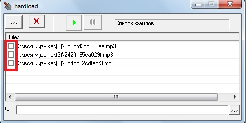

Для выделения файлов в чекбоксе (выделен красным цветом), необходимо нажать на квадратик возле каждого файла, который необходимо скопировать, либо удалить.

4. **Начать грузить** — позволяет копировать все документы, выделенные в чекбоксе, на изображении №7 кнопка выделена красным цветом.

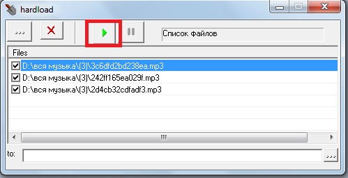

После отметки всех необходимых файлов в чекбоксе  для копирования и нажатии кнопки “Начать грузить”, файлы автоматически копируются в выбранную Вами папку для копирования.

**ОГРАНИЧЕНИЯ**: В чекбоксе обязательно должны быть добавлены галочки к тем файлам, которые необходимо скопировать, без выполнения данного условия, задача не будет выполнена.

5. **Остановить грузить** — позволяет отменить копирование всех выбранных файлов в чекбоксе. Используется при ошибочном нажатии кнопки “Начать грузить”.

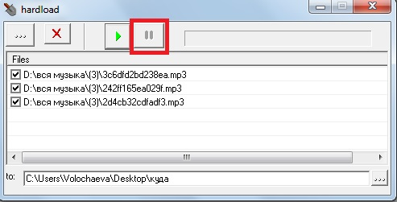

При нажатии кнопки “Остановить грузить” происходит отмена копирования всех выбранных файлов в чекбоксе запущенных кнопкой “Начать грузить”.

**ОГРАНИЧЕНИЯ**: Копирование останавливается только в том случае, если файлы при нажатии “Начать грузить” не были полностью скопированы.

6. **Удалить выделенные файлы из списка** — позволяет удалить все  выделенные файлы в чекбоксе.

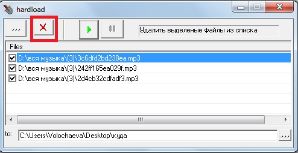

Из общего списка, в чекбоксе выбираем файлы, которые необходимо удалить. Далее нажимаем кнопку “Удалить выделенные файлы из списка”.

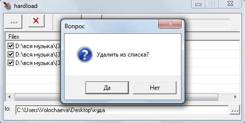

Подтверждаем удаление, путем нажатия на кнопку “Да”. Все необходимые файлы будут удалены из общего списка файлов к копированию.

**ОГРАНИЧЕНИЯ**: Данная кнопка не удаляет уже скопированные файлы из выбранной Вами ранее папки для копирования файлов.
